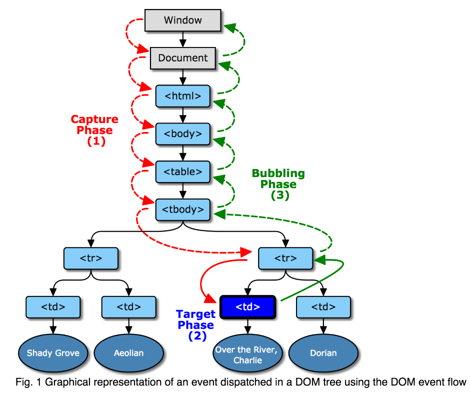
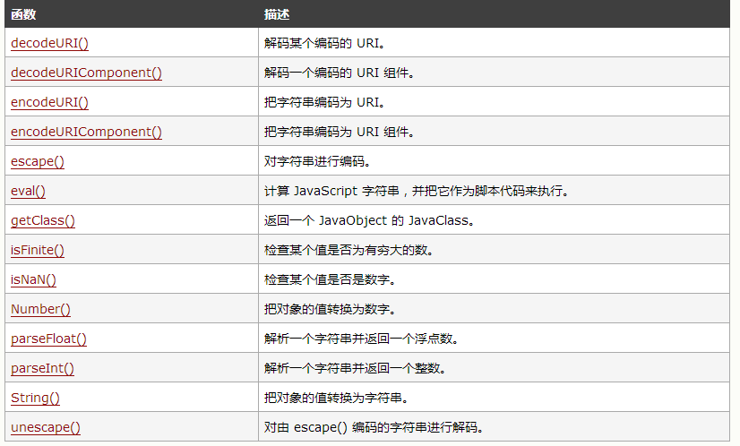

# JS 错题整理

1. 原型链；

   ```javascript
   var F = function() {}
   Object.prototype.a = function() {}
   Function.prototype.b = function() {}
   var f = new F();
   ```

   f 能取到 a，但取不到 b

   

   f 是 F 的实例，它与 Function 的 prototype 实例之间没有联系

2. 节点属性：

   ```HTML
   <html>
   <body>
    <div id="ele" class="div">
    <span id="s1" class="sp" lang="zh-cn">
    </span>
    </div>
   </body>
   <script type="text/javascript">  
    function exct() {
       var oEle = document.getElementById("ele");
       var child = oEle.children;
       console.log("ele.children的执行结果是:");
       for(i = 0; i < child.length; i++){
          console.log(child[i].tagName);
       }  
       child = oEle.childNodes;
       console.log("ele.childNodes的执行结果是:");
       for(i = 0; i < child.length; i++){
          console.log(child[i].tagName);
       }
    }  
    exct (); 
   </script>
   </html>
   ```

   ==其运行结果是：==

   ```html
   ele.children的执行结果是:
   SPAN
   ele.childNodes的执行结果是:
   undefined
   SPAN
   undefined
   ```

   对于DOM元素，children是指DOM Object类型的子对象，不包括tag之间隐形存在的TextNode，而childNodes包括tag之间隐形存在的TextNode对象

   1. childNodes - 元素.childNodes - 获取元素的所有**子节点**（伪数组）
   2. children - 元素.children - 获取元素的所有**子元素节点**（伪数组）

3. `this`指向：

   3.1

   ```javascript
   var obj ={a:1,b:function () {alert(this.a)}}; 
   var fun =obj.b; 
   fun();
   
   // 弹出 undefined
   ```

   this的行为有时候会显得极其诡异，让人感到困惑，但只需要记住 **this的值要等到代码真正执行时才能确定**
   同时this的值具体有以下几种情况：

   1. new 调用时指的是被构造的对象
   2. call、apply调用，指向我们指定的对象
   3. 对象调用，如执行obj.b()，this指向obj
   4. 默认的，指向全局变量window(相当于执行window.fun())

   这样看来，当你执行fun()的时候，以上1,2点均不满足。
   第3点,因为this是运行时确定的，而我们执行fun()，等同于windown.fun()(**与obj没有任何关系**)，自然的this指向window，而window没有定义变量a，结果是undefined。

   3.2 

   ```javascript
   3
   var obj = {};
   obj.log = console.log;
   obj.log.call(console,this);
   ```

   这道题看似在考this的绑定问题，实际上是通过this绑定为幌子，考察非严格模式下JavaScript语句中“this”默认指向全局对象（window）。

   题目的关键点在第3行，我们知道，this绑定的优先级是new>bind>call(apply)>obj.func()>默认绑定。也就是说obj.log.call(console, this)语句中，实际上log函数内的this实际上指代的是console（这也是本题最大的陷阱！）。然而实际上这一语句中obj.log.call(console, this)这一语句中打印的this是在外部传进去的，和函数内的this对象根本没有关系！也就是说此时log函数内的this指代console，但是打印的是从外面传进去的this对象，也就是window！

   为了证明这一点，读者朋友们可以把obj.log.call(console, this)中的console改成任意一个对象，然后在非严格模式下执行，会发现结果都是window

4. 变量的提前声明：

   ```javascript
   if(! "a" in window){
       var a = 1;
   }
   alert(a);
   
   // undefined
   ```

   if(! "a" in window)这句代码的意思是：判断全局对象window中是否有变量a，如果没有变量a，就进入判断将a赋值为1

   但是由于变量的提前声明，以上代码与如下代码等价：

   ```javascript
   var a；
   if（！“a” in window ）{
     a=1;
   }
   alert(a);
   ```

   由于变量的提前声明特性，在执行这段代码之后，全局对象window中就已经存在a这个变量了

   所以不能进入判断，对a进行赋值

   所以a的值为undefined

5. typeof 的结果

   ```javascript
   typeof Symbol()    	//"symbol"
   typeof Number()    	//"number"
   typeof String()    	//"string"
   typeof Function()	//"function"
   typeof Object()		//"object"
   typeof Boolean()	//"boolean"
   typeof null			//"object"
   typeof undefined	//"undefined"
   ```

6. w3c 制定的 javascript 标准事件模型

   ```
   事件捕获->事件处理->事件冒泡
   ```

   

7. 在事件中，this指向触发这个事件的对象， 特殊的是，IE中的attachEvent中的this总是指向全局对象Window；

8. ES6 规定，默认的 Iterator 接口部署在数据结构的Symbol.iterator属性，或者说，一个数据结构只要具有Symbol.iterator属性，就可以认为是“可遍历的”（iterable）。

   原生具备 Iterator 接口的数据结构如下：

   * Array
   * Map
   * Set
   * String
   * TypedArray
   * 函数的 arguments 对象
   * NodeList 对象

9. << 表示左移，先化为2进制，1为01，然后左移4位，成010000，再化为10进制，10000(二进制) = 16(十进制)。 接着a = a ^15 而a = 10，符号^表示异或，也就是比较对应的二进制位是否相同，相同为0，不同为1。 10的二进制 => 1010 15的二进制 => 1111 通过异或运算可以得到 0101 再转换成十进制即是5

10. 1.while的话只是在函数局部环境或者全局环境运行，并不会改变作用域链。 2.try catch红皮书第四章讲的清清楚楚：虽然执行环境的类型总共只有两种--全局和局部（函数），但还是有其他办法来延长作用域链。这么说是因为有些语句可以在作用域链的前端临时增加一个变量对象，该变量对象会在代码执行后被移除。在两种情况下回发生这种现象。具体来说，就是当执行流进入下列任何一个语句时，作用域链就会得到加强：   try catch语句的catch块；   with语句； 这两个语句都会在作用域链的前端添加一个变量对象。对WITH语句来说，将会指定的对象添加到作用域链中。对catch语句来说，会创建一个新的变量对象，其中包含的是被抛出的错误对象的声明。 Example： function builderUrl(){    var qs="?debug=true";    with(location){    var url = href + qs;      }   return url; } 在此，with语句接受的是location对象，因此其变量对象中就包含了Location对象的所有属性和方法，而这个变量对象被添加到了作用域链的前端。builderUrl()函数中定义了一个变量qs。当在with语句中引用变量href时（实际引用的是location.href），可以在当前执行环境的变量对象中找到。当引用变量qs时，引用的则是在buildUrl()中定义的那个变量，而该变量位于函数环境的变量对象中。至于with语句内部，则定义了一个名为url的变量，因而url就成了函数执行环节的一个部分，所以可以作为函数的值被返回。

11. 先解释一下“同步模式”和“异步模式”：

    （1）同步模式：就是后一个任务等待前一个任务结束，然后再执行，程序的执行顺序与任务的排列顺序是一致的、同步的。

    （2）异步模式：完全不同，每一个任务有一个或多个回调函数（callback），前一个任务结束后，不是执行后一个任务，而是执行回调函数，

    ​              后一个任务则是不等前一个任务结束就执行，所以程序的执行顺序与任务的排列顺序是不一致的、异步的。

    JavaScript中实现异步编程模式的4种方法,回调函数、事件监听、发布/订阅、Promises对象：

    （1）回调函数：这是异步编程最基本的方法，优点是简单、容易理解和部署，缺点是不利于代码的阅读和维护，各个部分之间高度耦合

    ​            （Coupling），流程会很混乱，而且每个任务只能指定一个回调函数。

    ​             例：假定有两个函数f1和f2，后者等待前者的执行结果，如果f1是一个很耗时的任务，可以考虑改写f1，把f2写成f1的回调函

    ​             数。

    （2）事件监听：任务的执行不取决于代码的顺序，而取决于某个事件是否发生。优点是比较容易理解，可以绑定多个事件，每个事件可以指定

    ​              多个回调函数，而且可以”去耦合”（Decoupling），有利于实现模块化。缺点是整个程序都要变成事件驱动型，运行流程会变

    ​              得很不清晰。

    ​              例：为f1绑定一个事件，当f1发生done事件，就执行f2。

    （3）发布/订阅：我们假定，存在一个”信号中心”，某个任务执行完成，就向信号中心”发布”（publish）一个信号，其他任务可以向信号中心”订

    ​              阅”（subscribe）这个信号，从而知道什么时候自己可以开始执行。这就叫做”发布/订阅模式”（publish-subscribe pattern），

    ​              又称”观察者模式”（observer pattern）。

    ​              这种方法的性质与”事件监听”类似，但是明显优于后者。因为我们可以通过查看”消息中心”，了解存在多少信号、每个信号

    ​              有多少订阅者，从而监控程序的运行。

    （4）Promises对象：是CommonJS工作组提出的一种规范，目的是为异步编程提供统一接口。简单说，它的思想是，每一个异步任务返回一个

    ​                 Promise对象，该对象有一个then方法，允许指定回调函数。回调函数变成了链式写法，程序的流程可以看得很清楚，而

    ​                 且有一整套的配套方法，可以实现许多强大的功能。

    ​                 例：f1的回调函数f2，f1().then(f2);

12. 

13. ```
    alert($(window).height()); //浏览器当前窗口可视区域高度 
    alert($(document).height()); //浏览器当前窗口文档的高度 
    alert($(document.body).height());//浏览器当前窗口文档body的高度 
    alert($(document.body).outerHeight(true));//浏览器当前窗口文档body的总高度 包括border padding margin 
    alert($(window).width()); //浏览器当前窗口可视区域宽度 
    alert($(document).width());//浏览器当前窗口文档对象宽度 
    alert($(document.body).width());//浏览器当前窗口文档body的高度 
    alert($(document.body).outerWidth(true));//浏览器当前窗口文档body的总宽度 包括border padding margin 
    ```

14. [AMD](https://github.com/amdjs/amdjs-api/wiki/AMD)是"Asynchronous Module Definition"的缩写，意思就是"异步模块定义"。它采用异步方式加载模块，模块的加载不影响它后面语句的运行。所有依赖这个模块的语句，都定义在一个回调函数中，等到加载完成之后，这个回调函数才会运行。
    AMD也采用require()语句加载模块，但是不同于CommonJS。
    主要有两个Javascript库实现了AMD规范：[require.js](http://requirejs.org/)和[curl.js](https://github.com/cujojs/curl)。
    参考链接：http://www.ruanyifeng.com/blog/2012/10/asynchronous_module_definition.html

    AMD 是 RequireJS 在推广过程中对模块定义的规范化产出。
    CMD 是 SeaJS 在推广过程中对模块定义的规范化产出。
    区别：
    \1. 对于依赖的模块，AMD 是**提前执行**，CMD 是**延迟执行**。
    \2. CMD 推崇**依赖就近**，AMD 推崇**依赖前置**。

    // CMD
    define(function(require, exports, module) {
    var a = require('./a')
    a.doSomething()
    // 此处略去 100 行
    var b = require('./b') // 依赖可以就近书写
    b.doSomething()
    // ...
    })

    

    // AMD 默认推荐的是
    define(['./a', './b'], function(a, b) { // 依赖必须一开始就写好
    a.doSomething()
    // 此处略去 100 行
    b.doSomething()
    ...
    })

15. 

16. 运算中，+号，数字隐式转换成字符串。其余的运算符号是字符串隐式转换成数字。

17. window.onload = function(){

      //首先获得下拉框的节点对象；

      var obj = document.getElementById("obj");

      //1.如何获得当前选中的值？：

      var value = obj.value;

      //2.如何获得该下拉框所有的option的节点对象

      var options = obj.options;

      //注意：得到的options是一个对象数组

      //3.如何获得第几个option的value值?比如我要获取第一option的value,可以这样：

      var value1 =options[0].value;

      //4.如何获得第几个option的文本内容?比如我要获取第一option的文本,可以这样：

      var text1 = options[0].text;

      //5.如何获得当前选中的option的索引？

      var index = obj.selectedIndex;

      //6.如何获得当前选中的option的文本内容？

      //从第2个问题，我们已经获得所有的option的对象数组options了

      //又从第5个问题，我们获取到了当前选中的option的索引值

      //所以我们只要同options[index]下标的方法得到当前选中的option了

      var selectedText =options[index].text;

    }

18. 加号优先级高于 三目运算。低于括号。 

19. **代码回收规则如下：**

    **1.全局变量不会被回收。**

    **2.局部变量会被回收，也就是函数一旦运行完以后，函数内部的东西都会被销毁。**

    **3.只要被另外一个作用域所引用就不会被回收**

20. undefined和null与任何有意义的值比较返回的都是false，但是null与undefined之间互相比较返回的是true

21. ```
    console.``log``(1);
    let a = setTimeout(() => {console.``log``(2)}, 0);
    console.``log``(3);
    Promise.resolve(4).then(b => {
    console.``log``(b);
    clearTimeout(a);
    });
    console.``log``(5);
    ```

    同步→异步→回调

    promise是异步微任务，

    setTimeout是异步宏任务，

    微任务比宏任务先执行，所以取消了定时器回调

22. forEach会忽略掉 [empty,....]