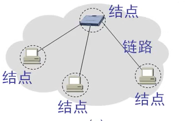
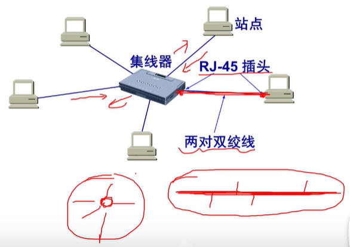
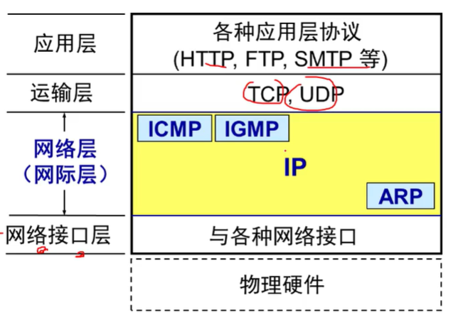
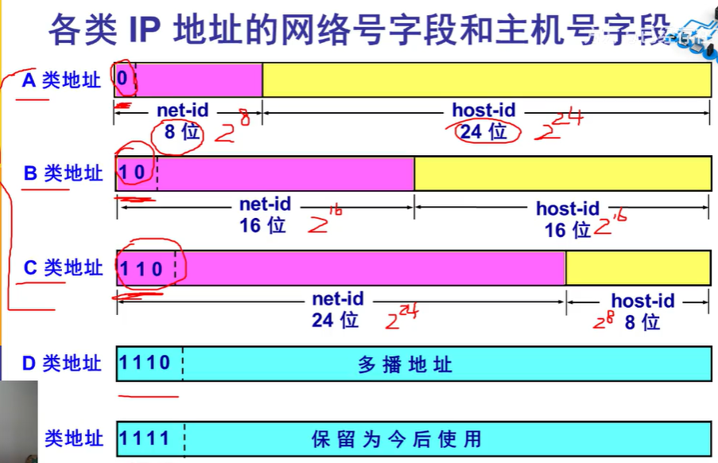
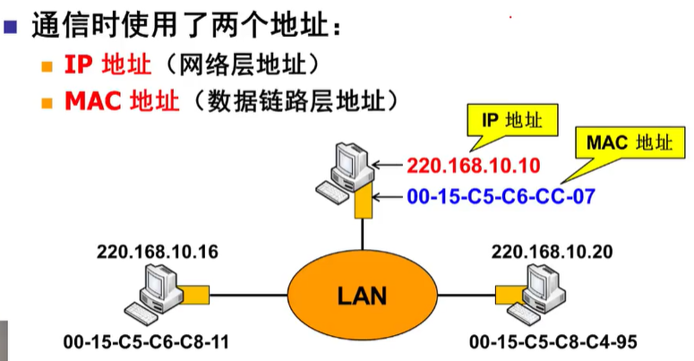
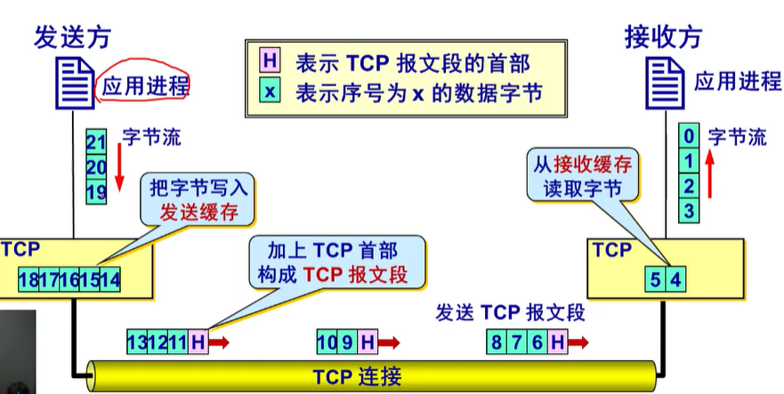
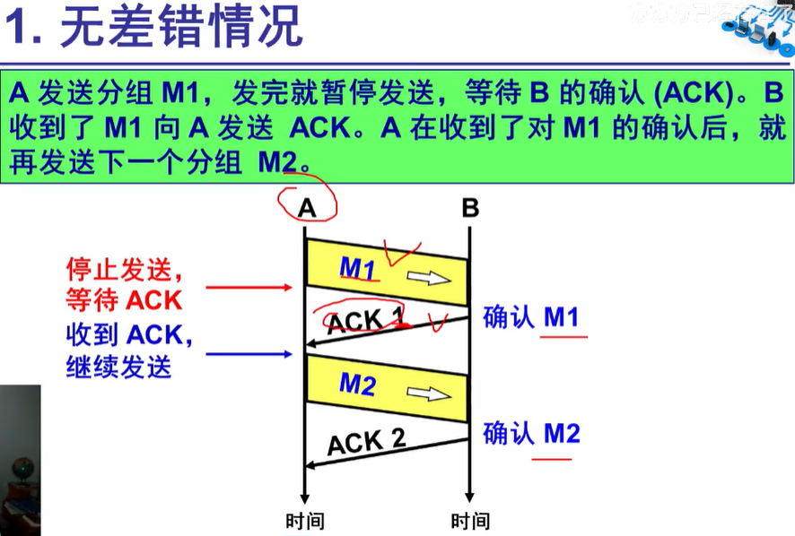
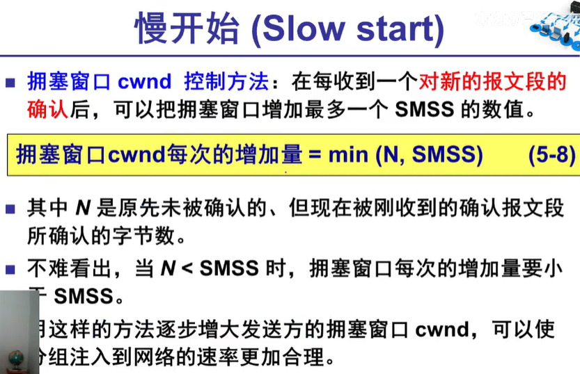
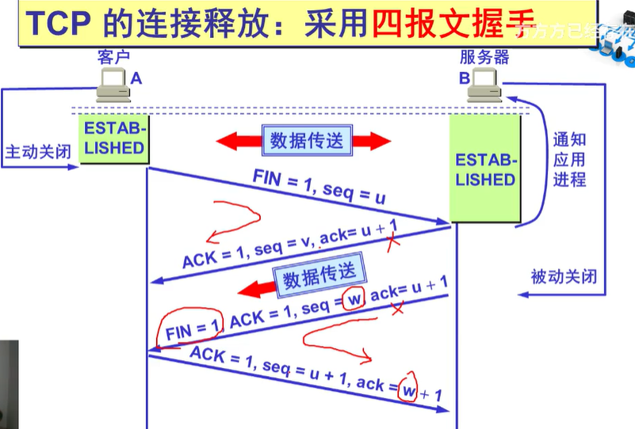
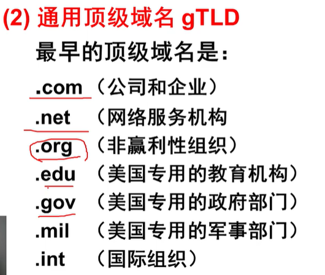

# 计算机网络笔记

作者：Max Zhang

## 1. 概述

### 1.1  计算机网络的重要功能

* 连通性：彼此连通，交换信息
* 共享：信息共享、软硬件共享

### 1.2 因特网概述

* 网络（Network）：许多计算机连接在一起

* 互连网（internet)：Network of Networks，许多网络连接在一起

* 因特网（Internet）：全球最大的一个互联网

***

ISP: Internet Service Provider互联网服务供应商

多层次ISP结构互联网

### 1.3 因特网的组成

**因特网**：

1. 核心部分：
   * 电路交换
   * 报文交换
   * 分组交换
2. 边缘部分：
   * 客户服务器方式
   * 对等方式

---

**边缘部分**：

<u>主机</u>间的<u>通信</u>方式：

* 客户服务器方式（Client/Server方式--C/S）

<u>客户软件的特点</u>：被用户调用后运行，在打算通信时主动向远地服务器发起通信（请求服务）。因此，客户程序必须知道服务器程序的地址。

<u>服务器软件的特点</u>：一种专门又来提供某种服务的程序，可同时处理多个远地或本地客户的请求。系统启动后即自动调用并一直不断地运行着，被动的等待并接受来自各地的客户的通信请求。因此，服务器程序不需要知道客户程序的地址。一般需要强大的硬件和高级的操作系统支持。

* 对等方式（Peer-to-Peer：P2P）

两个主机在通信时并不区分哪一个是服务请求方还是服务提供方。

只要两个主机都运行了对等连接软件（P2P软件），它们就可以进行平等的、对等链接通信。

双方都可以下载对方已经纯存在硬盘上的共享文档。

<u>对等连接方式的特点</u>：

对等链接方式从本质上看仍然是使用客户服务器方式，只是对等连接中的每一个主机即使客户又是服务器。

**核心部分**：

数据交换方式：

* 电路交换（Circuit Switching）

  

  电路交换<u>面向连接</u>：

  1. 建立连接：申请占用通信资源
  2. 通话：一直占用通信资源
  3. 释放连接：释放通信资源

  电路交换的<u>缺点</u>：

  * 计算机数据具有突发性
  * 这导致在传送计算机数据时，通信线路的利用率很低（用来传送数据的时间往往不到10%甚至1%）

  电路交换适合于数据量很大的实时性传输：核心路由器之间可以使用电路交换

  

* 分组交换（Packet Switching）

  把数据分组，加上*首部*（地址等信息）发送。

  接收端接收到多组数据，根据*首部*信息，将数据组合起来，并去掉*首部*

  * 优点：高效、灵活、迅速、可靠
  * 缺点：时延、开销

  >路由器
  >
  >在路由器中的输入和输出端口之间没有直接连线
  >
  >路由器处理分组的过程是：
  >
  >* 把收到的分组先放入缓存（暂时存储）
  >* 查找转发表，找出到某个目的地址应从哪个端口转发
  >* 把分组送到适当的端口转发出去

  

* 报文交换（Message Switching）

  相比于分组交换，报文交换数据不分组，

  * 报文一般比分组长的多
  * 报文交换的时延较长

### 1.4 计算机网络的类别

作用范围：

* 广域网 WAN
* 城域网 MAN
* 局域网 LAN
* 个人区域网 PAN

使用者：

* 公用网络 Public Network
* 专用网络 Private Network

拓扑结构：

* 总线型
* 环形
* 星型
* 树型
* 网状

交换方式：

* 电路交换网
* 报文交换网
* 分组交换网

工作方式：

* 资源子网
* 通信子网
* 接入网

### 1.5 计算机网络的性能

1. 速率：链接在计算机网络上的主机在数字信道上传送数据位数的速率，也称为data rate或bit rate

   单位是b/s，kb/s，Mb/s，Gb/s

2. 带宽：数据通信领域中，数字信道所能传送的最高数据率

   单位是b/s，kb/s，Mb/s，Gb/s

3. 吞吐量：在单位时间内通过某个网络的数据量

   单位是b/s，kb/s，Mb/s，Gb/s

4. 时延：

   * 发送时延：=数据块长度（比特）/信号带宽（比特/秒）
   * 传播时延：=信道长度（米）/信号在信道上的传播速率（米/秒）
   * 处理时延：网络节点储存转发处理时间
   * 排队时延：在节点处排队

5. 时延带宽积

   时延带宽积 = 传播时延 $\times$ 带宽

   在任何特定时间该网络线路上的最大数据量——已发送但尚未确认的数据

6. 往返时间（RTT：Round-Trip Time）

   从发送方发送数据开始，到发送方收到接收方确认

7. 利用率

   * 信道利用率 = 有数据痛过时间/（有+无）数据通过时间
   * 网络利用率：信道利用率加权平均值

   D = $D_{0}$/1-U

   $D_{0}$表示网络空闲时的时延

   D表示网络当前的时延

   U表示信道利用率

### 1.6 计算机网络的体系结构

基本概念：

* ISO：国际标准化组织
* OSI/RM：互联网法律上的国际标准
* TCP/IP Suite：因特网事实上的国际标准
* Network Protocols：数据交换遵守的规则、标准或约定
* 网络体系结构：计算机网络各层及其协议的集合

网络协议主要由三个要素组成：

* 语法：数据与控制信息的结构或格式
* 语义：需要发出何种控制信息，完成何种动作以及做出何种响应
* 同步：事件实现顺序的详细说明

各层完成的主要功能：

* 差错控制：试相应层次对等方的通信更加可靠
* 流量控制：发送端的发送速率必须使接收端来得及接收，不要太快
* 分段和重装：发送端将要发送的数据块划分为更小的单位，在接收端将其还原
* 复用和分用：发送端及格高层会话复用一条底层的连接，在接收端再进行分用
* 连接建立和释放：交换数据前先建立一条逻辑链接，数据传送结束后释放连接

（分层是为了标准化和降低每一层之间的关联）

|         OSI 模型         |                                            |
| :----------------------: | :----------------------------------------: |
|    应用层 Application    |  能搞产生网络流量能够和用户交互的应用程序  |
|   表示层 Presentation    |                 加密、压缩                 |
|      会话层 Session      |           服务和客户端建立的会话           |
|   **传输层 Transport**   | 可靠传输（建立会话）、不可靠传输、流量控制 |
|    **网络层 Network**    |          IP地址编址、选择最佳路径          |
| **数据链路层 Data Link** |        数据如何封装、添加物理层地址        |
|     物理层 Physical      |               电压、接口标准               |

网络排错：从底层到高层

网络安全和OSI参考模型：

* 物理层安全
* 数据链路层安全：ADSL、AP密码
* 网络层安全
* 应用层安全：SQL注入漏洞、上传漏洞

|     TCP/IP     |                                             |
| :------------: | :-----------------------------------------: |
|  Application   | 对应OSI的Application，presentation和Session |
|   Transport    |                对应Transport                |
|    Internet    |                 对应Network                 |
| Network Access |           对应Data Link和Physical           |

开放系统信息交换设计的几个概念：

* 实体（entity）：交换信息的硬件或软件进程
* 协议（protocol）：控制两个对等实体通信的规则
* 服务（service）：下层向上层提供服务，上层需要使用下层提供的服务来实现本层的功能
* 服务访问点（SAP）：相邻两层实体间交换信息的地方

## 2. 物理层

物理层的作用是尽可能地屏蔽掉不同传输媒体和通信手段的差异，使物理层上面的数据链路层感觉不到这些差异。

用于物理层的协议也常称为物理层**规程**（procedure）

可以将物理层的主要任务描述为确定于传输媒体的接口有关的一些特性，即：

* 机械特性：指明接口所用接线器的形状和尺寸、引脚数目和排列、固定和锁定装置，等
* 电气特性：指明在接口电缆设各条线上出现的电压的范围
* 功能特性：指明某条线上出现的某一电平的电压的意义
* 过程特性：指明对于不同功能的各种可能时间的出现顺序

信道基本概念：

* 信道：一般用来表示向某一个方向传送信息的媒体

* 单向信道（单工通信）：只能有一个方向的通信而没有反方向的交互

* 双向交替通信（半双工通信）：通信的双方都可以发送信息，但不能双方同时发送（当然也就不能同时接收）

* 双向同时通信（全双工通信）：通信的双方可以同时发送和接收信息

* 基带信号（即基本频带信号）：信源（信息源，也称发送端）发出的没有经过调制（进行频谱搬移和变换）的原始电信号，其特点是频率较低，信号频谱从零频附近开始，具有低通形式。根据原始电信号的特征，基带信号可分为数字基带信号和模拟基带信号（相应地，信源也分为数字信源和模拟信源），其由信源决定

  > 基带信号往往包含有较多的低频成分，甚至有直流成分，而许多信道并不能传输这种低频分量或直流分量。因此必须对基带信号进行调制

调制分为两大类：

* 基带调制：仅对基带信号的波形进行变换，使它能够与信道特征相适应。变换后的信号依然是基带信号。把这种过程称为编码

* 带通调制：使用载波进行调制，把基带信号的频率范围搬移到较高的频段，并转换为<u>模拟信号</u>，这样就能够更好地在模拟信道中传输（即仅在一段频率范围内能够通过信道）

  > 带通信号：经过载波调制后的信号
  
  最基本的二元调制方法有：
  
  * 调幅（AM）：载波的振幅随基带数字信号而变化
  * 调频（FM）：载波的频率随亟待数字信号而变化
  * 调相（PM）：载波的初始相位随基带数字信号而变化

## 3. 数据链路层

### 3.1 使用点对点信道的数据链路层

#### 3.1.1 数据链路和帧

* 链路（link，又称：物理链路）是一条无源的点到点的物理线路段，中间没有任何其他的交换结点
  * 一条链路只是一条通路的一个组成部分
* 数据链路（data link， 又称：逻辑链路）除了物理线路外，还必须有通信协议来控制这些数据的传输。若把实现这些协议的硬件加到链路上，就构成了数据链路
  * 现在最常用的方法是使用适配器（即网卡）来实现这些协议的硬件和软件
  * 一般的适配器都包括了数据链路层和物理层这两层的功能

数据链路层传送的是`帧`

数据链路层协议的三个基本问题：

* **封装成帧**

  封装成帧就是在一段数据的前后分别添加首部和尾部，然后就构成了一个帧。确定帧的界限。

  首部和尾部的一个重要作用就是进行`帧定界`

  

* **透明传输**

  > ​	如果数据中的某个字节的二进制代码恰好和SOH（开始）或EOT（结束）一样，数据链路层就会错误的“找到帧的边界”

  解决方法：`字节填充`（byte stuffing）或`字符填充`（character stuffing）

* **差错控制**

  循环冗余检验

### 3.2 点对点协议PPP

#### 3.2.1 PPP协议的特点

* 对于点对点的链路，奴前使用的最广泛的数据链路层协议是点对点协议PPP（Point-to-Point Protocol）
* 用户使用拨号电话线接入互联网时，用户计算机和ISP进行通信时所使用的数据链路层协议就是PPP协议

PPP协议应满足的需求：

* 简单
* 封装成帧
* 透明性
* 多种网络层协议
* 多种类型链路
* 差错检测
* 检测连接状态
* 最大传送单元
* 网络层地址协商
* 数据压缩协商

PPP协议不需要的功能：

* 纠错
* 流量控制
* 序号
* 多点线路
* 半双工或单工链路

PPP协议的组成：

1. 一个将IP数据报封装到串行链路的方法
2. 链路控制协议LCP（Link Control Protocol）
3. 网络控制协议NCP（Network Control Protocol）

#### 3.2.2 PPP协议的帧格式

#### 3.2.3 PPP协议的工作状态

### 3.3 使用广播信道的数据链路层

#### 3.3.1 局域网的数据链路层

局域网最主要的**特点**是：

* 网络为一个单位所拥有
* 地理范围和站点数目均有限

局域网具有如下**主要优点**：

* 具有广播功能，从一个站点可以很方便的访问全网。局域网上的主机可共享连接在局域网上的各种硬件和软件资源
* 便于系统的扩展和逐渐的演变，各设备的位置可灵活调整和改变
* 提高了系统的可靠性、可用性和残存性

#### 3.3.2 CSMA/CD协议

含义：载波监听多点接入/碰撞检测

**多点接入**：表示许多计算机以多点接入的方式连接在一根总线上

**载波监听**：指每一个站在发送数据之前要检测一下总线上是否有其他计算机在发送数据。如果有，则暂时不要发送数据，以免发生碰撞

**碰撞检测**：计算机边发送数据边检测信道上的信号电压大小

CSMA/CD重要特性：

* 使用CSMA/CD协议的以太网不能进行全双工通信而**只能进行双向交替通信（半双工通信）**
* 每个站在发送数据之后的一小段时间内，存在着遭遇碰撞的可能性
* 这种**发送的不确定性**使整个以太网的平均通信量远小于以太网的最高数据率

#### 3.3.3 使用集线器的星型拓扑

#### 3.3.4 以太网的信道利用率

* 多个站在以太网上同时工作就可能回发生碰撞
* 当发生碰撞时，信道资源实际上是被浪费了。因此，当扣除碰撞所造成的信道损失后，以太网总的信道利用率并不能达到100%
* 征用其长度为端到端传播时延的两倍。检测到碰撞后不发送干扰信号

#### 3.3.5 以太网的MAC层

1. MAC层的硬件地址

   * 在局域网中，**硬件地址**又被称为**物理地址**， 或**MAC地址**
   * 802标准所说的“地址”严格的讲应当是每一个站的“**名字**”或**标识符**

2. MAC帧的格式

   最常用的MAC帧是**以太网V2的格式**

### 3.4 拓展的以太网

#### 3.4.1 在物理层扩展以太网

**使用光纤扩展**、**使用集线器扩展**

#### 3.4.2 在数据链路层扩展以太网

早期使用**网桥**，现在使用以太网**交换机**

#### 3.4.3 虚拟局域网

* 利用以太网交换机可以很方便的实现虚拟局域网VLAN（Virtual LAN）
* **虚拟局域网VLAN**是由一些局域网网段构成的<u>与物理位置无关的逻辑组</u>，而这些网段具有某些共同的需求。每一个VLAN的帧都有一个明确的标识符，指明发送这个帧的计算机是属于哪一个VLAN
* **虚拟局域网其实只是局域网给用户提供的一种服务，而并不是一种新型局域网**
* 由于虚拟局域网是用户和网络资源的逻辑组合，因此可按照需要将有关设备和资源非常方便的重新组合，使用户从不同的服务器或数据库中存取所需的资源。

## 4. 网络层

### 4.1 网络层提供的两种服务

**虚电路服务**（Virtual Circuit）：通信之前先建立虚电路，以保证双方通信所需的一切网络资源。如果再使用可靠传输的网络协议，就可以使发送的分组无差错按序到达终点，不丢失、不重复。

**数据报服务**：网络层向上只提供简单灵活的、**无连接的**、**尽最大努力交付**的**数据报服务**。网络在发送分组时不需要先建立连接。每一个分组（即IP数据报）独立发送，与其前后的分组无关（不进行编号）。**网络层不提供服务质量的承诺**。

### 4.2 网际协议IP

#### 4.2.1 虚拟互联网络

如何将异构的网络互相连接起来？

使用一些中间设备进行互联

* 将网络互相连接起来要使用一些中间设备
* 中间设备又称为中间系统或中继系统
* 有以下五种不同的中间设备
  * `数据层`中继系统：**转发器**（repeater）
  * `数据链路层`中继系统：**网桥**或**桥接器**（bridge）
  * `网络层`中继系统：**路由器**（router）
  * 网桥和路由器的`混合物`：**桥路器**（brouter）
  * `网络层以上`的中继系统：**网关**（gateway）

#### 4.2.2 分类的IP地址

IP地址就是给每个连接在互联网上的主机（或路由器）分配一个在全世界范围是为唯一的32位标识符

**分类的IP地址**：最基本的编址方法

* 将IP地址划分为若干个固定类
* 每一类地址都有两个固定长度的字段组成，其中一个字段是**网络号net-id**，它标志主机（或路由器）所连接到的网络，而另一个字段则是**主机号host-id**，它标志该主机（或路由器）
* 主机号在它前面的网络号所指明的网络范围内必须是唯一的
* 由此，一个IP地址在整个互联网范围内是唯一的

点分十进制法：例128.11.3.31

IP地址的一些重要特点：

1. IP地址是一种分等级的地址结构

2. 实际上IP地址是标志一个主机（或路由器）和一条链路的接口

   > * 当一个主机同时连接到两个网路上时，该主机就必须同时具有两个相应的IP地址，其网络号net-id必须是不同的。这种主机称为**多归属主机**（multihomed host）
   > * 由于一个路由器至少应当连接到两个网络，（这样他才能将IP数据报从一个网络转发到另一个网络），因此一个路由器至少应当有两个不同的IP地址

3. 用转发器或网桥连接起来的若干个局域网仍为一个网络，因此这些局域网都具有同样的网络号net-id 

4. 所有分配到网络号net-id的网络，无论是范围很小的局域网，还是可能覆盖很大地理范围的广域网，都是平等的

**子网的划分**：对最基本的编址方法的改进

**构成超网**：比较新的无分类编址方法

#### 4.2.3 IP地址与硬件地址

* IP地址与硬件地址时不同的地址
* 从层次的角度看
  * **硬件地址（或物理地址）**是数据链路层和物理层使用的地址
  * **IP地址**是网络层和以上各层使用的地址，是一种`逻辑地址`（称IP地址是逻辑地址是因为IP地址使用软件实现的）

#### 4.2.4 地址解析协议ARP

当已知一个机器的IP地址，可以用地址解析协议ARP用来找出相应的硬件地址。

#### 4.2.5 IP数据报的格式

* 一个IP数据报由**首部**和**数据**两部分组成
* 首部的前一部分是固定长度，共20字节，是所有IP数据报必须具有的
* 在手部的固定部分后面是一些可选字段，其长度是可变的

#### 4.2.6 IP层转发分组的流程

### 4.3 划分子网和构造超网

### 4.4 国际控制报文协议ICMP

ICMP差错报告报文共有四种：

* 终点不可达
* 时间超过
* 参数问题
* 改变路由（重定向）

### 4.5 互联网的路由选择协议

### 4.6 IPv6

### 4.7 IP多播

### 4.8 虚拟专用网VPN和网络地址转换NAT

### 4.9 多协议标记交换MPLS

## 5 运输层

### 5.1 运输层协议概述

#### 5.1.1 进程之间的通信

#### 5.1.2 运输层的两个主要协议

(1)**用户数据报协议**(User Datagram Protocol)

(2)**传输控制协议TCP**（Transmission Control Protocol）

* 当运输层采用<u>面向连接</u>的**TCP**协议时，尽管下面的网络是不可靠的（只提供尽最大努力服务），但这种逻辑通信信道就相当于一条**全双工的可靠信道**。
* 当运输层采用<u>无连接</u>的**UDP**协议时，这种逻辑通信信道时一条**不可靠信道**。

UDP:一种无连接协议

* 提供无连接服务
* **在传送数据之前不需要先建立连接**
* 传送的数据单位协议是`UDP报文`或`用户数据报`
* 对方的运输层在收到UDP报文后， 不需要给出任何确认
* 虽然UDP不提供可靠交付，但在某些情况下UDP是一种最有效的工作方式

TCP：一种面向连接的协议

* 提供面向连接的服务
* 传送的数据单位协议是`TCP报文段`（segment）
* **TCP不提供广播或多播服务**
* 由于TCP要**提供可靠的、面向连接的运输服务**，因此不可避免的增加了许多的开销。这不仅使协议数据单元的首部增大很多，还要占用许多的处理机资源

#### 5.1.3 运输层的端口

* 端口用一个16位端口号进行标志
* 端口号只具有`本地意义`，即端口号只是为了标志`本计算机应用层中的各进程`

### 5.2 用户数据报协议UDP

### 5.3 传输控制协议TCP概述

* TCP是`面向连接`的运输层协议
* 每一条TCP连接`只能有两个端点`（endpoint），每一条TCP连接`只能是点对点`的（一对一）
* TCP提供`可靠交付`的服务
* TCP提供`全双工`通信
* `面向字节流`：
  * TCP中的“流”（stream）指的是流入或流出进程的字节序列
  * “面向字节流”的含义是：虽然应用程序和TCP的交互式一次一个数据块，但TCP把应用程序交下来的数据看成仅仅是一连串无结构的字节流

### 5.4 可靠传输的工作原理

#### 5.4.1 停止等待协议

#### 5.4.2 连续ARQ协议

### 5.5 TCP报文段的首部格式

### 5.6 TCP可靠传输的实现

#### 5.6.1 以字节为单位的滑动窗口

#### 5.6.2 超时重传时间的选择

#### 5.6.3 选择确认SACK

### 5.7 TCP的流量控制

#### 5.7.1 利用滑动窗口实现流量控制

#### 5.7.2 TCP的传输效率

### 5.8 TCP的拥塞控制

#### 5.8.1 拥塞控制的一般原理

#### 5.8.2 TCP的拥塞控制方法

* 慢开始
* 拥塞避免
* 快重传
* 快恢复

#### 5.8.3 主动队列管理AQM

### 5.9 TCP的运输连接管理

三个阶段：

* 连接建立
* 数据传送
* 连接释放

* TCP连接的建立采用客服服务器方式
* 主动发起连接建立的应用进程叫做`客户`
* 被动等待连接建立的应用进程叫做`服务器`

#### 5.9.1 TCP的连接建立

* TCP建立连接的过程叫做`握手`
* 握手需要在客户和服务器之间交换三个TCP报文段。称之为`三报文握手`
* 采用`三报文握手`主要是为了防止已失效的连接请求报文突然又传送到了，因而产生错误

#### 5.9.2 TCP的连接释放

TCP连接释放过程是`四报文握手`

#### 5.9.3 TCP的有限状态机

## 6 应用层

### 6.1 域名系统DNS

### 6.2 文件传送协议

#### 6.2.1 FTP概述

#### 6.2.2 FTP的基本工作原理

#### 6.2.3 简单的文件传送协议

### 6.3 远程终端协议TELNET

### 6.4 万维网WWW

#### 6.4.1 万维网概述

#### 6.4.2 统一资源定位符URL

* 使用`统一资源定位符`URL（Uniform Resource Locator）来标志万维网上的各种文档
* 使每一个文档在整个互联网的范围内具有唯一的标识符URL

URL的一般形式：

* 由以冒号隔开的两大部分组成，并且在URL中的字符对大写或小写没有要求

* URL的一般形式是：

  

  

  

#### 6.4.3 超文本传送协议HTTP

* 在万维网客户程序与万维网服务器程序之间进行交互使用的协议，是`超文本传送协议`HTTP（HyperText Transfer Protocol）
* HTTP是一个应用层协议，它使用TCP连接进行可靠的传送

#### 6.4.4 万维网的文档

#### 6.4.5 万维网的信息检索系统

#### 6.4.6 博客和微博

#### 6.4.7 社交网络

### 6.5 电子邮件

### 6.6 动态主机配置协议DHCP

### 6.7 简单网络管理协议SNMP

### 6.8 应用进程跨越网络的通信

### 6.9 P2P应用
